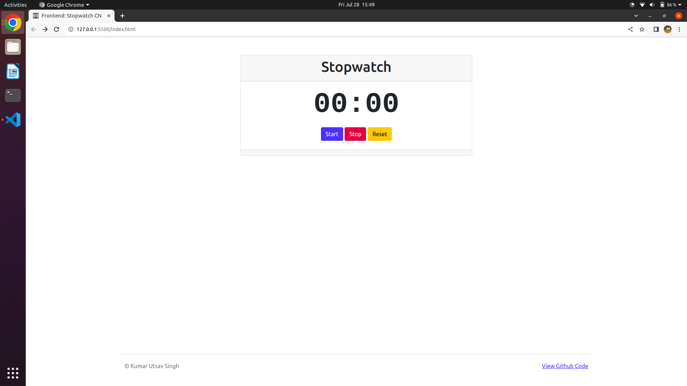

# Frontend-test-Stopwatch-CN
Frontend test: Stopwatch For coding Ninja project

[See it in action](https://kus0023.github.io/Frontend-test-Stopwatch-CN/)

### We have a Clock class which contains below three main functions
- start
- stop
- reset

Which was the basic requirement of the project.

### Clock will have two attributes which are:

 - time: contains the time in seconds
 - timeInterval: contains the integer value returned from setInterval func. This will be used to stop the clock.

### 1. Function Start:
It will take a optional function parameter. This function will be called inside start function. Basically whatever work you want to perform every second. In this project we will update the time on the screen.
This function is using setInterval function which is provided by javascript.

### 2. Function Stop:
This function will clear the interval by using clearInterval function. But it will not delete or reset the time. So that if we want to restart the clock by using clock.start method then the clock will start from prev time.

### 3. Function Reset:
This function will clear the interval and also it will set time to '0'. So that if we start the clock again then it will start from 00:00.

### 4. Funtion getFormattedTime
This funtion will provide formatted time.

# Innovation
Added functionality to show the stopped timings. It will automatically cleared out when you hit reset button.
I think stop watches should have this feature as well. :smile:

References:
https://developer.mozilla.org/en-US/docs/Web/API/setInterval

Editor:
VsCode

Extensions:
Live server (Latest): https://marketplace.visualstudio.com/items?itemName=yandeu.five-server

## Screenshot

